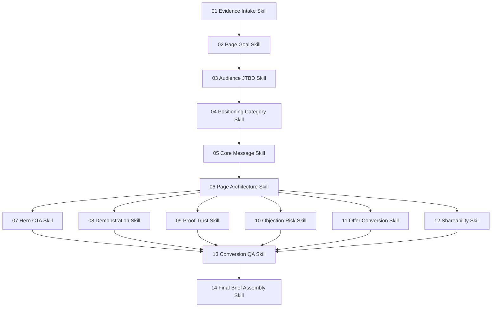

# AI Agent Skills Design for Page Production

## Source of truth
- Status: Draft
- Last refreshed: 2026-06-18
- Purpose: 웹 페이지를 전략적으로 제작하기 위한 AI 에이전트 스킬 세트를 설계한다.
- Scope:
  - SaaS 메인 페이지
  - 랜딩 페이지
  - 제품/서비스 소개 페이지
  - 세일즈 페이지
  - 퍼스널/브랜드 페이지
  - 캠페인 페이지
  - 프리랜서/에이전시 제안 페이지
  - 콘텐츠 기반 전환 페이지
- Important distinction:
  - SaaS 홈페이지 분석은 스킬 설계의 참고 사례다.
  - 스킬의 목적은 SaaS 페이지에 한정되지 않는다.
  - 공통 목적은 “방문자를 이해시키고, 신뢰시키고, 다음 행동으로 이동시키는 페이지”를 만드는 것이다.
- Primary artifact to build next:
  - 페이지 제작 에이전트 스킬 명세
  - 스킬별 입력/출력 스키마
  - 페이지 유형별 분기 규칙
  - 실행 순서와 품질 게이트
- Evidence reviewed:
  - Local marketing/business corpus: `스토리브랜드.md`, `포지셔닝.md`, `마케팅의 22가지 불변의 법칙.md`, `기억에 남는 아이디어.md`, `입소문은 어떻게 퍼지는가.md`, `100달러 스타트업.md`, `퍼스널 MBA.md`, `피칭하지 않고도 이기는 선언문.md`, and related files.
  - SaaS homepage references: Slack, Notion, Linear, Stripe, Shopify, HubSpot, Dropbox, Figma.
- Core finding:
  - 좋은 페이지는 디자인 산출물이기 전에 전략 산출물이다.
  - 페이지 유형이 달라도 핵심 순서는 같다: `증거 수집 → 방문자/상황 정의 → 포지셔닝 → 핵심 메시지 → 페이지 구조 → 카피/CTA → 증거/리스크 → QA`.

## Product goal
- Goal:
  - 책 요약과 유명 SaaS 페이지 패턴을 기반으로, 다양한 웹 페이지 제작에 재사용 가능한 AI 에이전트 스킬 시스템을 설계한다.
- Non-goals:
  - 지금 단계에서 실제 페이지를 구현하지 않는다.
  - 특정 SaaS 제품 전용 스킬로 고정하지 않는다.
  - 근거 없는 고객 로고, 수치, 후기, 보안 인증, 비교 우위를 생성하지 않는다.
  - 범용 “예쁜 페이지 생성기”로 만들지 않는다.
- Success signals:
  - 각 스킬이 페이지 유형과 무관하게 재사용 가능하다.
  - 페이지 유형별로 필요한 분기만 명확히 존재한다.
  - 다음 단계에서 바로 `SKILL.md`, 프롬프트, 워크플로, 오케스트레이터로 옮길 수 있다.
  - 품질 게이트가 모호한 카피, 과장, 증거 없는 주장, 목적 없는 디자인을 차단한다.

## Page types

```yaml
page_types:
  saas_homepage:
    goal: trial_signup | demo_request | product_understanding
    special_needs: product_demo, integrations, security, pricing, AI_workflow_if_applicable
  landing_page:
    goal: single_campaign_conversion
    special_needs: message_match, offer, CTA_focus, objections
  product_page:
    goal: product_purchase_or_inquiry
    special_needs: features, benefits, specs, proof, comparison, pricing
  service_page:
    goal: qualified_lead_or_booking
    special_needs: problem_fit, process, trust, deliverables, case_studies
  sales_page:
    goal: direct_purchase
    special_needs: offer_stack, urgency_if_real, guarantee, objections, pricing
  personal_brand_page:
    goal: trust_and_follow_or_contact
    special_needs: point_of_view, proof_of_work, story, audience_fit
  agency_or_freelancer_page:
    goal: qualified_client_inquiry
    special_needs: positioning, niche, process, portfolio, qualification
  content_conversion_page:
    goal: subscription_download_or_next_step
    special_needs: topic_promise, authority, sample_value, opt_in
```

## Design constraints
- Evidence-first:
  - 모든 주요 주장에는 `evidence`, `inference`, `unknown` 중 하나의 상태가 있어야 한다.
  - 증거 없는 주장은 최종 카피가 아니라 `missing_proof`로 이동한다.
- Page-type aware:
  - SaaS 페이지에 필요한 보안/통합/제품 데모가 모든 페이지에 필요한 것은 아니다.
  - 세일즈 페이지의 보증/가격/오퍼 스택이 퍼스널 브랜드 페이지에 항상 필요한 것은 아니다.
  - 스킬은 공통 구조를 유지하되 페이지 유형별 필수 블록을 다르게 선택해야 한다.
- Sequential locking:
  - 하위 스킬은 상위 전략 결정을 임의로 바꾸지 않는다.
  - 예: Hero CTA Skill은 Positioning Skill의 `owned_word`, `primary_audience`, `page_goal`을 변경하지 않는다.
- Clean handoff:
  - 각 스킬 출력은 다음 스킬 입력으로 그대로 들어갈 수 있는 구조여야 한다.
- Human-reviewable:
  - 출력은 짧은 산문만이 아니라 YAML/JSON에 가까운 구조를 포함해야 한다.
- Anti-slop:
  - 추상어, 과잉 형용사, 범용 표현, 목적 없는 비주얼 제안을 감점한다.
- Ethical conversion:
  - 공포 조장, 가짜 긴급성, 가짜 희소성, 허위 비교, 과장된 AI 자율성을 금지한다.

## System architecture



## Shared data model

All skills should read and write a shared `PageBrief` object.

```yaml
PageBrief:
  metadata:
    project_name:
    page_type:
    page_url:
    product_or_offer_stage:
    market_or_context:
    source_materials:
  evidence:
    factual_inputs: []
    audience_facts: []
    competitor_or_alternative_facts: []
    proof_assets: []
    unknowns: []
  page_goal:
    primary_goal:
    secondary_goals: []
    conversion_event:
    success_metric:
    non_goals: []
  audience:
    primary_audience:
    secondary_audiences: []
    situation:
    urgent_job:
    current_pain:
    desired_outcome:
    buying_or_action_trigger:
    objections: []
  positioning:
    frame:
    category_or_context:
    owned_word:
    main_alternative:
    contrast:
    not_for: []
    tradeoffs: []
  message:
    core_claim:
    repeatable_phrase:
    emotional_hook:
    concrete_scene:
    anti_jargon_rules: []
  page:
    section_order: []
    hero:
    cta_stack:
    demonstration_blocks: []
    proof_blocks: []
    objection_blocks: []
    offer_blocks: []
    share_blocks: []
  qa:
    unsupported_claims: []
    vague_phrases: []
    ethical_risks: []
    page_type_mismatches: []
    readiness_score:
```

## Skill specifications

### 01. Evidence Intake Skill
- Purpose:
  - 원자료를 수집하고 사실, 추론, 미확인을 분리한다.
- Inputs:
  - 제품/서비스/개인/캠페인 설명
  - 고객 인터뷰, 리뷰, 세일즈 노트, 기존 페이지, 경쟁/대안 페이지
  - 사용 가능한 증거 자료
  - 참고 원칙 또는 리서치 자료
- Outputs:
```yaml
evidence:
  factual_inputs:
    - claim:
      source:
      confidence:
  audience_facts:
    - claim:
      source:
      confidence:
  competitor_or_alternative_facts:
    - claim:
      source:
      confidence:
  proof_assets:
    - type: logo | metric | testimonial | case_study | screenshot | portfolio | credential | security | integration | media | result
      value:
      source:
      usable_on_page: true | false
  unknowns:
    - question:
      impact:
```
- Quality gate:
  - 출처 없는 수치/로고/후기/성과는 `proof_assets`에 넣지 않는다.
  - 불확실한 내용은 `unknowns`에 남긴다.

### 02. Page Goal Skill
- Purpose:
  - 만들 페이지의 유형, 전환 목표, 성공 지표를 결정한다.
- Inputs:
  - `metadata`
  - `evidence.factual_inputs`
  - user/project request
- Outputs:
```yaml
page_goal:
  page_type:
  primary_goal:
  secondary_goals:
  conversion_event:
  success_metric:
  non_goals:
  required_sections_by_type:
  optional_sections_by_type:
```
- Quality gate:
  - 한 페이지에 여러 1순위 목표를 두지 않는다.
  - 페이지 유형과 CTA가 충돌하면 실패.

### 03. Audience JTBD Skill
- Purpose:
  - 누가 왜 지금 이 페이지에서 행동해야 하는지 정의한다.
- Inputs:
  - `page_goal`
  - `evidence.audience_facts`
  - `evidence.unknowns`
- Outputs:
```yaml
audience:
  primary_audience:
  secondary_audiences: []
  situation:
  urgent_job:
  current_pain:
  desired_outcome:
  buying_or_action_trigger:
  success_metric:
  objections:
    - objection:
      severity: high | medium | low
      evidence:
```
- Quality gate:
  - “모든 사람”, “모든 팀”, “관심 있는 사람” 같은 넓은 관객은 실패.
  - 행동할 이유와 맥락이 있어야 통과.

### 04. Positioning Category Skill
- Purpose:
  - 페이지가 방문자의 머릿속에서 차지할 위치를 정한다.
- Inputs:
  - `page_goal`
  - `audience`
  - alternatives/competitors
- Outputs:
```yaml
positioning:
  frame: product | service | expertise | campaign | content | community
  category_or_context:
  owned_word:
  main_alternative:
  contrast:
  why_now:
  not_for:
    - audience:
      reason:
  tradeoffs:
    - chosen:
      sacrificed:
```
- Quality gate:
  - `owned_word`는 하나여야 한다.
  - “더 좋다”보다 “왜 다르게 봐야 하는가”가 명확해야 한다.

### 05. Core Message Skill
- Purpose:
  - 방문자가 기억하고 전달할 수 있는 한 문장으로 압축한다.
- Inputs:
  - `page_goal`
  - `audience`
  - `positioning`
- Outputs:
```yaml
message:
  core_claim:
  one_sentence:
  repeatable_phrase:
  concrete_scene:
  emotional_hook:
  before_after:
    before:
    after:
  banned_phrases: []
```
- Quality gate:
  - 페이지 유형과 무관하게 고객/방문자의 변화가 중심이어야 한다.
  - 추상어는 구체적 장면으로 치환한다.

### 06. Page Architecture Skill
- Purpose:
  - 페이지 유형에 맞는 정보 구조와 섹션 순서를 만든다.
- Inputs:
  - `page_goal`
  - `audience`
  - `positioning`
  - `message`
  - `proof_assets`
- Outputs:
```yaml
page:
  section_order:
    - id:
      title:
      purpose:
      required_inputs:
      proof_needed:
      page_type_reason:
      success_criteria:
```
- Common section candidates:
  - Hero
  - Proof belt
  - Problem/current state
  - Product/service/demo/process block
  - Feature-to-outcome or service-to-result blocks
  - Offer/value stack
  - Use case/persona blocks
  - ROI/value block
  - Credentials/security/integration/portfolio trust block
  - Case study/testimonial
  - FAQ/objections
  - Final CTA
- Quality gate:
  - 페이지가 기능 덤프나 자기소개 나열처럼 보이면 실패.
  - 각 섹션은 페이지 목표와 연결되어야 한다.

### 07. Hero CTA Skill
- Purpose:
  - 첫 화면 카피와 CTA 스택을 생성한다.
- Inputs:
  - `page_goal`
  - `message`
  - `positioning`
  - `proof_assets`
- Outputs:
```yaml
hero:
  eyebrow:
  headline:
  subheadline:
  proof_line:
  primary_cta:
    label:
    destination:
    intent:
  secondary_cta:
    label:
    destination:
    intent:
cta_stack:
  primary:
  secondary:
  low_commitment:
  high_intent:
  repeat_locations:
```
- Quality gate:
  - 헤드라인은 5초 안에 이해되어야 한다.
  - “Learn more”는 primary CTA로 금지.
  - CTA는 실제 다음 행동이어야 한다.

### 08. Demonstration Skill
- Purpose:
  - 페이지가 약속하는 가치를 구체적으로 보여준다.
- Inputs:
  - `page_goal`
  - product/service/process/content capabilities
  - `audience.urgent_job`
- Outputs:
```yaml
demonstration_blocks:
  - type: product_demo | process | before_after | portfolio | sample_output | walkthrough | case_snapshot
    name:
    before_state:
    input_or_starting_point:
    action_or_method:
    output_or_result:
    measurable_result:
    visual_needed:
    caption:
```
- Quality gate:
  - 추상적 설명만 있고 보여줄 장면이 없으면 실패.
  - SaaS는 UI 흐름, 서비스는 프로세스/결과, 개인 브랜드는 작업물/관점, 콘텐츠는 샘플 가치가 중심이다.

### 09. Proof Trust Skill
- Purpose:
  - 신뢰 자산을 배치하고 부족한 증거를 드러낸다.
- Inputs:
  - `proof_assets`
  - generated claims from prior skills
- Outputs:
```yaml
proof_blocks:
  - claim:
    proof_type:
    proof_value:
    source:
    placement:
missing_proof:
  - claim:
    needed_proof:
    risk_if_published:
```
- Quality gate:
  - 증거 없는 주장은 최종 페이지 카피로 보내지 않는다.
  - 페이지 유형별 신뢰 자산을 구분한다: SaaS는 로고/수치/보안, 서비스는 사례/프로세스/후기, 개인 브랜드는 작업물/미디어/관점.

### 10. Objection Risk Skill
- Purpose:
  - 행동을 막는 리스크를 선제적으로 처리한다.
- Inputs:
  - `audience.objections`
  - pricing/onboarding/process/security/support facts
- Outputs:
```yaml
objection_blocks:
  - objection:
    answer:
    proof_or_policy_needed:
    page_placement:
faq:
  - question:
    answer:
    evidence_status: evidence | inference | unknown
```
- Quality gate:
  - FAQ가 filler 질문이면 실패.
  - 가격, 시간, 신뢰, 난이도, 적합성, 리스크 중 해당되는 것을 다룬다.

### 11. Offer Conversion Skill
- Purpose:
  - 방문자의 다음 행동을 정당화하는 오퍼, 가치, 가격/비용 프레임을 설계한다.
- Inputs:
  - `page_goal`
  - offer/product/service facts
  - `audience.desired_outcome`
- Outputs:
```yaml
offer_blocks:
  - offer_name:
    included_value:
    expected_outcome:
    cost_or_commitment:
    risk_reversal:
    urgency_or_deadline:
    evidence_status:
```
- Quality gate:
  - 긴급성/희소성은 실제 근거가 있을 때만 사용한다.
  - 가격 또는 비용이 있다면 가치/회수/결과와 연결한다.

### 12. Shareability Skill
- Purpose:
  - 방문자나 사용자가 공유할 이유와 산출물을 설계한다.
- Inputs:
  - `message`
  - product/service/content outputs
  - audience social context
- Outputs:
```yaml
share_blocks:
  - talker:
    topic:
    trigger:
    shareable_artifact:
    social_currency:
    referral_or_invite_cta:
```
- Quality gate:
  - 공유 장치가 페이지 목표와 무관하면 제거한다.
  - 가짜 희소성이나 조작적 바이럴 루프는 금지.

### 13. Conversion QA Skill
- Purpose:
  - 전체 산출물의 품질, 윤리, 증거, 명료성, 페이지 유형 적합성을 검수한다.
- Inputs:
  - full `PageBrief`
- Outputs:
```yaml
qa:
  readiness_score: 0-100
  unsupported_claims:
    - claim:
      location:
      action: remove | revise | needs_proof
  vague_phrases:
    - phrase:
      replacement:
  ethical_risks:
    - risk:
      location:
      severity:
      fix:
  page_type_mismatches:
    - mismatch:
      location:
      fix:
  missing_inputs:
    - input:
      blocking: true | false
  pass: true | false
```
- Quality gate:
  - `pass: true`는 unsupported critical claims가 0개일 때만 가능하다.
  - 페이지 유형과 맞지 않는 섹션/CTA가 있으면 Final Brief Assembly로 진행하지 않는다.

### 14. Final Brief Assembly Skill
- Purpose:
  - 검증된 스킬 출력을 구현 가능한 페이지 브리프로 조립한다.
- Inputs:
  - QA를 통과한 `PageBrief`
- Outputs:
```yaml
final_brief:
  strategy_summary:
  page_type:
  page_goal:
  target_audience:
  positioning:
  core_message:
  page_sections:
  hero_copy:
  cta_stack:
  demonstration_requirements:
  proof_requirements:
  objection_handling:
  offer_blocks:
  shareability:
  open_questions:
  implementation_notes:
```
- Quality gate:
  - 브리프는 디자이너/개발자/카피라이터/마케터가 각자 작업에 바로 사용할 수 있어야 한다.

## Skill execution rules
- Run order:
  1. Evidence Intake
  2. Page Goal
  3. Audience JTBD
  4. Positioning Category
  5. Core Message
  6. Page Architecture
  7. Hero CTA
  8. Demonstration
  9. Proof Trust
  10. Objection Risk
  11. Offer Conversion
  12. Shareability
  13. Conversion QA
  14. Final Brief Assembly
- Retry rules:
  - If QA finds vague phrases, return to the skill that generated them.
  - If QA finds unsupported claims, return to Proof Trust or remove claim.
  - If audience is too broad, return to Audience JTBD before any copy work continues.
  - If positioning has more than one owned word, return to Positioning Category.
  - If page type and CTA conflict, return to Page Goal.
- Parallelizable skills:
  - Demonstration, Proof Trust, Objection Risk, Offer Conversion, and Shareability can run in parallel after Page Architecture if their required inputs exist.
- Non-parallelizable locks:
  - Evidence Intake must precede all.
  - Page Goal must precede Audience JTBD.
  - Audience JTBD must precede Positioning.
  - Positioning must precede Core Message.
  - Core Message must precede Hero.
  - QA must precede Final Brief Assembly.

## Prompt design pattern

Each skill prompt should follow this frame:

```markdown
# Role
You are the [skill name].

# Goal
Produce [specific artifact] for a page-production brief.

# Inputs
[structured input object]

# Constraints
- Do not invent proof.
- Mark uncertainty explicitly.
- Preserve upstream locked decisions.
- Respect page type.
- Output only the requested schema plus concise notes.

# Output schema
[expected YAML schema]

# Quality gate
Before finalizing, check:
- [skill-specific checks]
```

## File/artifact plan for next step

If these skills are implemented as repo-local skill documents, use this structure:

```text
skills/
  page-evidence-intake/SKILL.md
  page-goal/SKILL.md
  page-audience-jtbd/SKILL.md
  page-positioning/SKILL.md
  page-core-message/SKILL.md
  page-architecture/SKILL.md
  page-hero-cta/SKILL.md
  page-demonstration/SKILL.md
  page-proof-trust/SKILL.md
  page-objection-risk/SKILL.md
  page-offer-conversion/SKILL.md
  page-shareability/SKILL.md
  page-conversion-qa/SKILL.md
  page-final-brief/SKILL.md
  page-orchestrator/SKILL.md
```

## Naming conventions
- Prefix all skills with `page-`, not `saas-page-`.
- SaaS-specific behavior belongs inside page-type branching, not the skill name.
- Good:
  - `page-positioning`
  - `page-proof-trust`
  - `page-conversion-qa`
  - `page-demonstration`
- Avoid:
  - `saas-page-only-*`
  - `marketer`
  - `copywriter`
  - `landing-page-helper`

## QA-validated sales-readiness additions

Dry-run QA across SaaS homepage, service page, and content conversion page found that the original design needed stricter sales-readiness gates. The implemented skills now require:

- `traffic_source` / source promise capture in `page-goal`; if unknown, message match cannot fully pass.
- `traffic_source_promises` in `page-evidence-intake`.
- Proof assets with `permission_status` and `evidence_kind`.
- Testimonial proof requires exact quote text, attribution level, and permission status.
- Interview-reported or customer-reported metrics must be labeled as reported evidence, not guaranteed or audited results.
- `page-proof-trust` must provide `allowed_wording` and `safe_revision` for claims.
- `page-offer-conversion` must handle page-type mechanics:
  - trial terms for trial/signup pages,
  - booking qualification for consultation pages,
  - lead magnet delivery, privacy/consent, unsubscribe, and after-submit expectations for email courses/free offers.
- `page-conversion-qa` must return exact upstream `page-*` skill names in `skills_to_rerun`.
- `page-final-brief` must include a sales-readiness checklist and post-launch measurement plan.

External sales-readiness criteria used for QA:
- Clear value proposition in the first screen / first 10 seconds.
- One primary conversion goal and matching CTA.
- Message match between source promise, visitor intent, headline, and offer.
- Above-fold CTA.
- Demonstration of value.
- Authentic proof near claims.
- Objection handling.
- Mobile, speed, accessibility, and Core Web Vitals requirements.
- Measurement plan and iteration/A-B testing loop.

## Acceptance checklist
- [x] Every skill has purpose, inputs, outputs, and quality gate.
- [x] Shared `PageBrief` object supports multiple page types.
- [x] SaaS is represented as one page type, not the whole system.
- [x] Skill dependencies and retry loops are explicit.
- [x] Evidence and unsupported claims are handled structurally.
- [x] Page-type mismatches can be detected by QA.
- [x] Conversion QA can block final assembly.
- [x] Actual `SKILL.md` files have been created and statically verified.

## Open questions
- [ ] Should the next deliverable be actual `SKILL.md` files or a single consolidated prompt pack? / Impact: determines file layout.
- [ ] Should the skills target one orchestrator agent calling sub-skills, or independent manually invoked skills? / Impact: determines prompt contracts and state handoff.
- [ ] Should output schemas be strict YAML, JSON Schema, or markdown with YAML blocks? / Impact: determines parser/automation compatibility.
- [ ] Will these skills live in this book-analysis directory or in a separate implementation repo? / Impact: determines where to create files.
